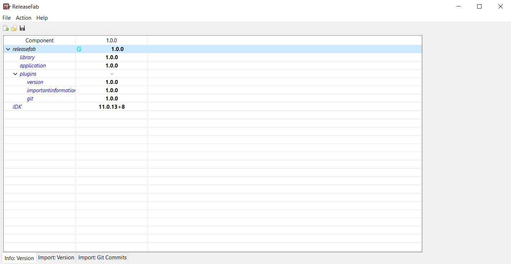

# ReleaseFab

ReleaseFab is a Java client application which atomatically generates Release Notes for any project. The information can be gathered from multiple different sources including the source code itself, the Git repository and an Application Lifecycle Management System of your choice.

The application is highly configurable. This is achieved through a plugin architecture based on the Java Platform Module System. More information on the architecture is available in the [Wiki of the project](https://github.com/comlet/releasefab/wiki).

## Preview

ReleaseFab can be used on the command line and as a GUI application which utilizes the Eclipse Standard Widget Toolkit (SWT).

<figure>
    
    <figcaption>ReleaseFab Graphical User Interface</figcaption>
</figure>

## Getting Started

ReleaseFab can either be run as a standalone application, created with jlink, or in combination with a TCK-compliant JDK of your choice.

If you want to contribute to the project, please follow the development instructions and guidelines in the [Wiki](https://github.com/comlet/releasefab/wiki).

### Standalone Application

In order to run the standalone version of the application, download the desired standalone version from the [List of releases](https://github.com/comlet/releasefab/releases). Unpack the Zip-File and run `ReleaseFab_Standalone.bat` on Windows or `ReleaseFab_Standalone.sh` on unix-based systems.

For ReleaseFab to launch the parameters mentioned in the [Wiki](https://github.com/comlet/releasefab/wiki) need to be set. Information on how to use the application is also available in the [Wiki](https://github.com/comlet/releasefab/wiki).

### Using a custom JDK

When using a JDK of your choice, at least version 9 is required to build the application. This is due to the application being based on the Java Platform Module System. Instructions on how to build the application from source can be found in the [Wiki](https://github.com/comlet/releasefab/wiki). Available binaries are built using the Adoptium JDK in Version 11. The offered [releases](https://github.com/comlet/releasefab/releases) are built with jlink which makes them runnable without installing a JVM on your system.

The exact version of the Adoptium JDK used for a specific release is documented in the [Release Notes](https://github.com/comlet/releasefab/releases) of that version. To ensure consistent behaviour between different machines, your JDK should be certified by the Java Technology Compatibility Kit. 

To use a custom JDK which fulfills the criteria mentioned above, the variable `JAVA_HOME` in the `releasefab.bat` file on Windows and `releasefab.sh` script on unix-based systems has to be modified to the root path of your Java installation (e.g. C:\Users\user\languages\jdk). This is only applicable if the application is built from source and jlink is not used.

## Code of Conduct

When contributing please always adhere to the [Code of Conduct](CODE_OF_CONDUCT.md).

## Legal

This program and the accompanying materials are made available under the terms of the Eclipse Public License 2.0 which is available at [LICENSE.md](LICENSE.md) or https://www.eclipse.org/legal/epl-2.0/. SPDX-License-Identifier: EPL-2.0.

The project uses open-source libraries and image resources. A list of the libraries used by this project can be obtained in the [Bill of Materials](https://github.com/comlet/releasefab/wiki/Bill-of-Materials). This is also where attribution to the image resources utilized in the project can be found.
